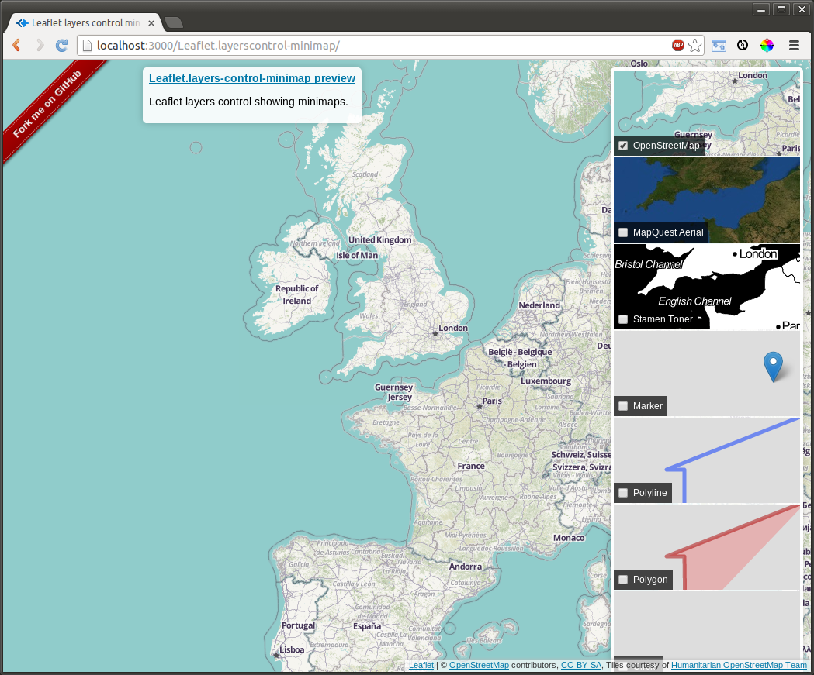

# Leaflet Layers control with minimaps

Displays minimaps in a layers control.

 - Only updates layers currently in view.
 - uses [Leaflet.Sync](https://github.com/turban/Leaflet.Sync) and [leaflet-clonelayer](https://github.com/jieter/leaflet-clonelayer)
 - Tested with Leaflet 0.7.3 and 1.0.0-rc.1
 - [Available on npm](https://www.npmjs.com/package/leaflet.layerscontrol-minimap): `npm install leaflet.layerscontrol-minimap`

## Usage

Exactly like [Leaflets default layers control](http://leafletjs.com/reference.html#control-layers),
with some extra options. Add the scripts + css to your html:

```HTML
<link rel="stylesheet" href="control.layers.minimap.css" />
<script src="L.Control.Layers.Minimap.js"></script>
```
and add the control to your map:

```JavaScript
L.control.layers.minimap(basemaps, overlays, options).addTo(map);
```

## npm

Leaflet layers control minimap is available via npm too:

`npm install leaflet.layerscontrol-minimap`


### Extra options

In addition to the options available for `L.Control.Layers`:

 - `topPadding`: number of pixels padding to the top of the map. Defaults to `10`.
 - `bottomPadding`: number of pixels padding at the bottom of the map. Defaults to `40`.
 - `overlayBackgroundLayer` a (tile)layer which is added to the minimap of each overlay as a background. If set to false, no background layer wil be used for overlays. Defaults to [Hydda Base](http://leaflet-extras.github.io/leaflet-providers/preview/#filter=Hydda.Base)

### Extra methods

One extra method is added:

 - `filter(string)`: if called with a non-empty string is passed, only layers with a name containing that substring are shown, while the others are set to `display: none`. The method will return a map with the layers currently visible.

## Live example

http://jieter.github.io/Leaflet.layerscontrol-minimap/


